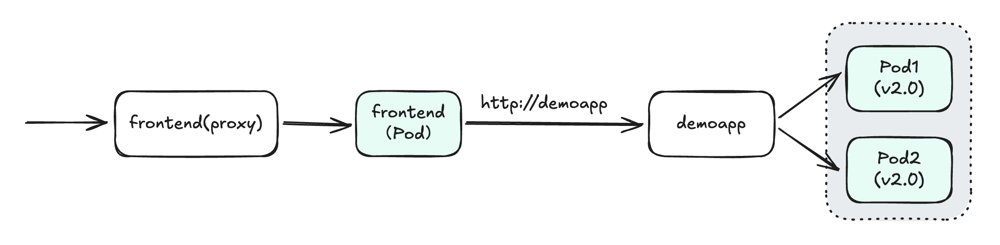
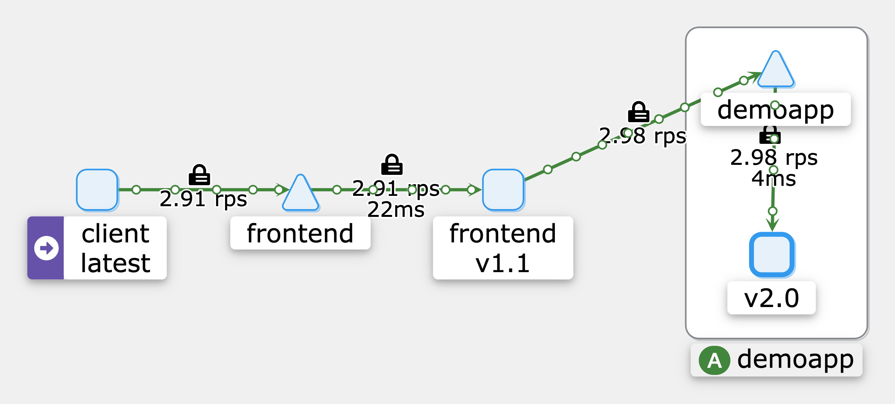

# 基础 Demo 应用部署

本示例演示了一个基础的前后端分离架构应用，用于 Istio 流量管理功能演示。

## 应用架构

应用由两个微服务组成：

- **Frontend (前端应用)**
  - 镜像: `vvoo/frontend:v1.1`
  - 部署: 1 个副本
  - 服务端口: 80 (对内) → 5901 (容器)
  - 环境变量:
    - `BACKEND_URL`: http://demoapp:80
    - `PORT`: 5901
    - `PROXY_VERSION`: v1.0

- **Demoapp (后端应用)**
  - 镜像: `vvoo/demoapp:v2.0`
  - 部署: 2 个副本
  - 服务端口: 80 (对内) → 8080 (容器)
  - 环境变量:
    - `PORT`: 8080
    - `VERSION`: v2.0

## 应用通信流程

前端应用作为代理，将请求转发到后端应用进行处理。



## 部署说明

使用以下命令部署应用:

```bash
kubectl apply -f deploy-frontend.yaml
kubectl apply -f deploy-demoapp.yaml
```

访问测试：

```bash
kubectl run client -it --rm --image=vvoo/admin-box --restart=Never --command -- bash
while true; do curl frontend ; sleep 0.$RANDOM; done
```

## 请求响应图

