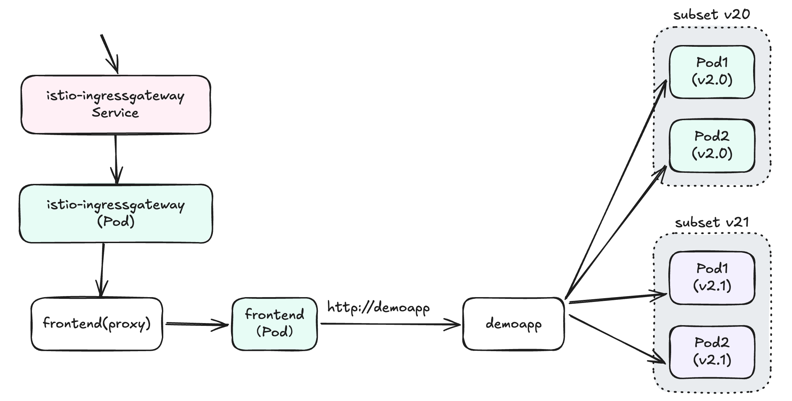
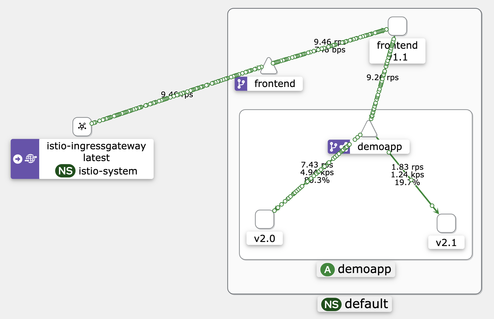

# Istio 流量管理 - 外部网关访问示例

本示例在 02-demoapp-subset 的基础上，添加了 Istio Gateway 配置，实现从集群外部访问前端服务。通过 Gateway 和 VirtualService 资源，将外部流量引入到 Kubernetes 集群内的服务中。

## 应用架构

本示例包含以下组件：

1. **前端应用**
   - 镜像: `vvoo/frontend:v1.1`
   - 环境变量:
     - `BACKEND_URL`: http://demoapp:80
     - `PORT`: 5901
     - `PROXY_VERSION`: v1.1

2. **后端应用 (两个版本)**
   - **Demoapp v2.0**
     - 镜像: `vvoo/demoapp:v2.0`
     - 标签: `version: v2.0`
     - 环境变量: `VERSION: v2.0`
   
   - **Demoapp v2.1**
     - 镜像: `vvoo/demoapp:v2.0` (使用相同镜像，通过环境变量区分版本)
     - 标签: `version: v2.1`
     - 环境变量: `VERSION: v2.1`

## 应用通信流程

外部请求通过 Istio Gateway 进入集群，然后被路由到前端应用，前端应用再将请求转发到后端服务。后端服务根据流量分配规则，将请求分发到不同版本的后端应用实例。



## Istio 流量管理配置

### Gateway

定义了一个入口网关，用于接收外部流量：

```yaml
apiVersion: networking.istio.io/v1
kind: Gateway
metadata:
  name: frontend-gateway
spec:
  selector: 
    istio: ingressgateway # 选择标签为 istio=ingressgateway 的 Istio Ingress Gateway 部署
  services:
  - port:
      number: 80 # 监听的端口号
      name: http # 端口名称
      protocol: HTTP # 使用的协议
    hosts:
    - "frontend.ops.com" # 允许访问的主机名，需要在 DNS 或 hosts 文件中配置
```

### VirtualService

配置路由规则，将来自网关的流量路由到前端服务：

```yaml
apiVersion: networking.istio.io/v1beta1
kind: VirtualService
metadata:
  name: frontend
spec:
  gateways:
    - frontend-gateway # 关联到前面定义的 Gateway，用于外部流量入口
    - mesh # 同时支持网格内部流量
  hosts:
    - "frontend.ops.com" # 匹配请求的主机名
  http:
  - name: default
    match:
    - uri: 
        prefix: / # 匹配所有 URI 路径
    route:
    - destination:
        host: frontend.default.svc.cluster.local # 目标服务域名，即集群内部service资源
        port: 
          number: 80 # 目标服务端口
```

### DestinationRule

定义了后端服务的子集，用于流量分配：

```yaml
apiVersion: networking.istio.io/v1beta1
kind: DestinationRule
metadata:
  name: demoapp
spec:
  host: demoapp
  subsets:
  - name: v20
    labels:
      version: v2.0
  - name: v21
    labels: 
      version: v2.1
```

### 后端服务 VirtualService

配置后端服务的流量分配规则：

```yaml
apiVersion: networking.istio.io/v1beta1
kind: VirtualService
metadata:
  name: demoapp
spec:
  hosts:
    - demoapp
  http:
  - route:
    - destination: 
        host: demoapp
        subset: v20
      weight: 80
    - destination:
        host: demoapp
        subset: v21
      weight: 20
```

## 部署说明

按以下顺序部署应用和 Istio 配置:

```bash
# 部署应用
kubectl apply -f deploy-demoapp.yaml
kubectl apply -f deploy-demoapp-v21.yaml

# 应用 Istio 流量管理配置
kubectl apply -f destinationrule.yaml
kubectl apply -f virtualservice.yaml

# 部署网关配置
kubectl apply -f frontend-gateway.yaml
kubectl apply -f frontend-virtualservice.yaml
```

## 访问测试

1. 添加 hosts 文件配置（替换 INGRESS_IP 为实际的 Ingress Gateway IP）：

```bash
echo "INGRESS_IP frontend.ops.com" | sudo tee -a /etc/hosts
```

2. 使用浏览器访问 http://frontend.ops.com 或使用命令行测试：

```bash
curl -H "Host: frontend.ops.com" http://INGRESS_IP
```

3. 观察后端服务的流量分配：

```bash
kubectl run client -it --rm --image=vvoo/admin-box --restart=Never --command -- bash
while true; do curl frontend ; sleep 0.$RANDOM; done
```

预期结果：约 80% 的请求返回 v2.0 版本响应，20% 的请求返回 v2.1 版本响应。


## 请求响应图

