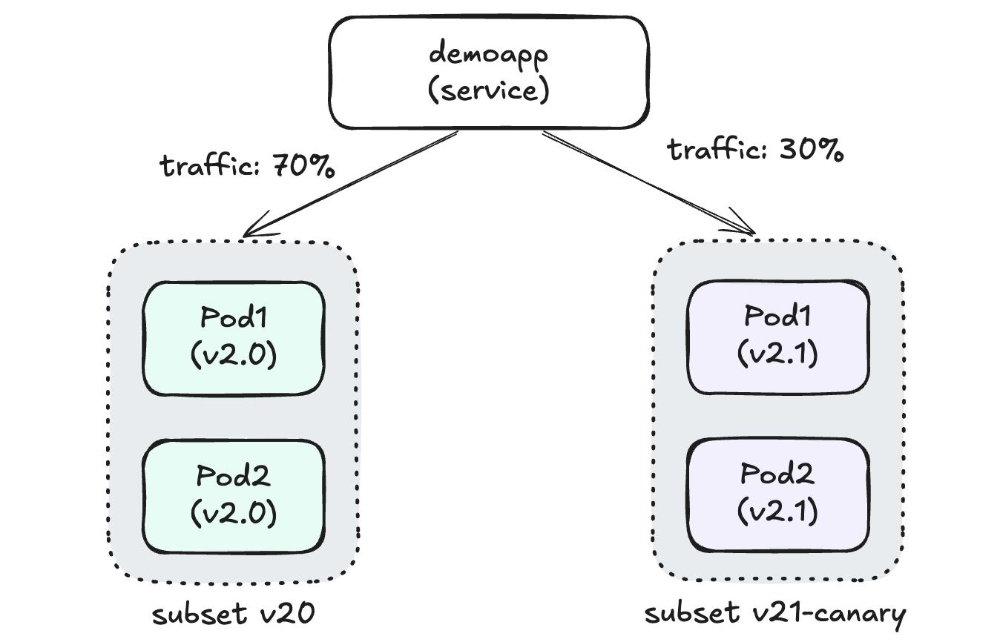

# Istio 流量管理 - URL 重定向和重写示例

本示例演示了 Istio 的 URL 重定向（Redirect）和重写（Rewrite）功能，通过这些功能可以实现路径转发、API 版本控制和金丝雀测试等高级流量管理场景。

## 应用架构

本示例部署了同一应用的两个不同版本：

- **Demoapp v2.0**
  - 镜像: `vvoo/demoapp:v2.0`
  - 部署: 2 个副本
  - 标签: `version: v2.0`
  - 环境变量:
    - `PORT`: 8080
    - `VERSION`: v2.0

- **Demoapp v2.1** (金丝雀版本)
  - 镜像: `vvoo/demoapp:v2.0` (使用相同镜像，通过环境变量区分版本)
  - 部署: 2 个副本
  - 标签: `version: v2.1`
  - 环境变量:
    - `PORT`: 8080
    - `VERSION`: v2.1

两个版本共用同一个 Service：`demoapp`，通过 Istio 的流量管理功能进行请求分发。



## URL 重定向和重写功能说明

本示例实现了三种不同的流量管理策略：

1. **URL 重定向（Redirect）**
   - 当访问 `/name` 路径时，会被重定向到 `/hostname` 路径
   - 这是一个 HTTP 301 重定向，浏览器会显示新的 URL

2. **URL 重写（Rewrite）+ 金丝雀测试**
   - 当访问 `/canary` 路径时，URL 会被重写为 `/`，并路由到 v2.1 版本（金丝雀版本）
   - 用户看到的仍然是 `/canary` 路径，但实际请求的是服务的根路径

3. **默认路由**
   - 所有其他请求都会路由到 v2.0 版本

## Istio 流量管理配置

### DestinationRule

定义了两个服务子集:
- `v20`: 对应 `version: v2.0` 标签的 Pod（稳定版本）
- `v21-canary`: 对应 `version: v2.1` 标签的 Pod（金丝雀版本）

```yaml
apiVersion: networking.istio.io/v1beta1
kind: DestinationRule
metadata:
  name: demoapp
spec:
  host: demoapp
  subsets:
  - name: v20
    labels:
      version: v2.0
  - name: v21-canary
    labels: 
      version: v2.1
```

### VirtualService

配置 URL 重定向、重写和路由规则:

```yaml
apiVersion: networking.istio.io/v1beta1
kind: VirtualService
metadata:
  name: demoapp
spec:
  hosts:
    - demoapp
  http:
    - name: redirect # URL 重定向规则
      match: 
        - uri:
            prefix: /name # 匹配 URI 前缀为 /name 的请求
      redirect:
        uri: /hostname # 将请求重定向到 /hostname 路径
    - name: canary # URL 重写规则（金丝雀测试）
      match:
        - uri: 
            prefix: /canary # 匹配 URI 前缀为 /canary 的请求
      rewrite:
        uri: / # 将请求路径重写为根路径 /
      route:
        - destination:
            host: demoapp
            subset: v21-canary # 路由到金丝雀版本
    - name: default # 默认规则
      route:
      - destination:
          host: demoapp
          subset: v20 # 路由到稳定版本
```

## 部署说明

按以下顺序部署应用和 Istio 配置:

```bash
# 部署两个版本的应用
kubectl apply -f deploy-demoapp.yaml
kubectl apply -f deploy-demoapp-v21.yaml

# 应用 Istio 流量管理配置
kubectl apply -f destinationrule.yaml
kubectl apply -f virtualservice-demoapp.yaml
```

## 访问测试

使用以下命令测试不同的路径:

```bash
# 创建测试客户端
kubectl run client -it --rm --image=vvoo/admin-box --restart=Never --command -- bash

# 测试默认路由（应该路由到 v2.0 版本）
curl demoapp/

# 测试 URL 重定向（应该被重定向到 /hostname 路径）
curl -L demoapp/name

# 测试 URL 重写（应该路由到 v2.1 版本）
curl demoapp/canary
```


## 请求响应图


## URL 重定向和重写的区别

1. **URL 重定向（Redirect）**:
   - 客户端收到 HTTP 301/302 响应，需要发起新的请求
   - 浏览器地址栏 URL 会改变
   - 适用于 API 版本迁移、域名变更等场景

2. **URL 重写（Rewrite）**:
   - 在服务端内部修改请求路径，客户端无感知
   - 浏览器地址栏 URL 不变
   - 适用于内部服务版本控制、API 结构调整等场景
