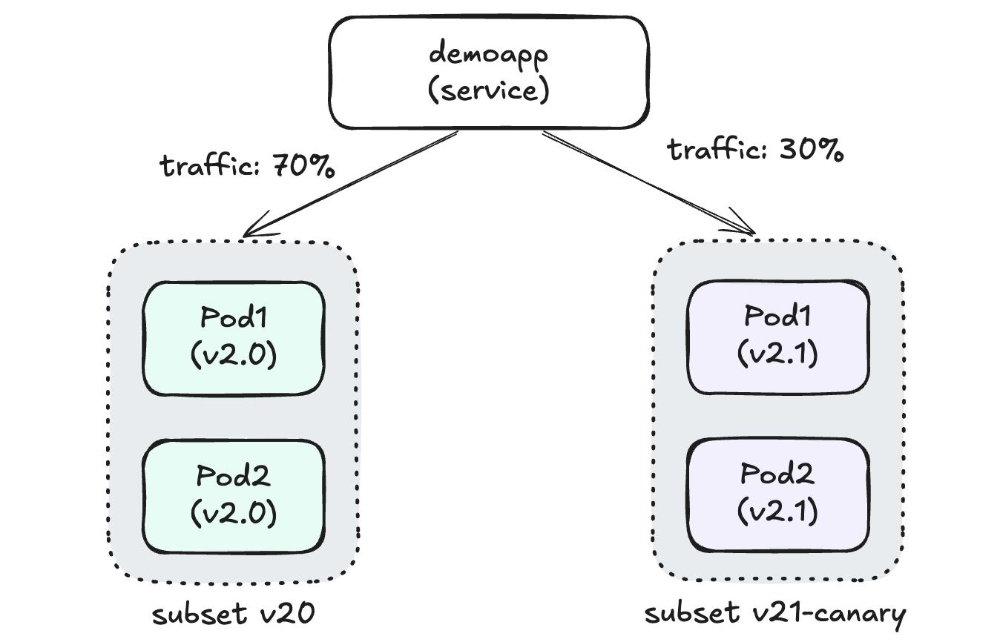
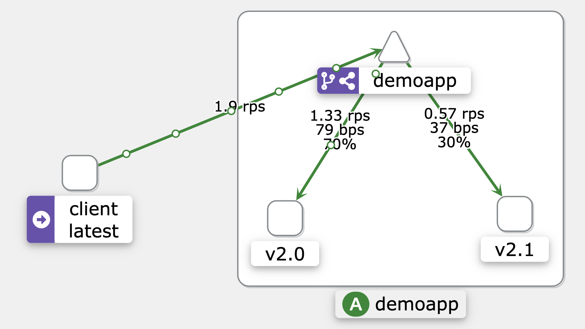

# Istio 流量管理 - 基于权重的流量分配示例

本示例演示了 Istio 的基于权重的流量分配功能（Weight-based Routing），通过为不同版本的服务分配不同的流量权重，实现精确的流量控制和灰度发布。

## 应用架构

本示例部署了同一应用的两个不同版本：

- **Demoapp v2.0** (稳定版本)
  - 镜像: `vvoo/demoapp:v2.0`
  - 部署: 2 个副本
  - 标签: `version: v2.0`
  - 环境变量:
    - `PORT`: 8080
    - `VERSION`: v2.0
  - 流量权重: 70%

- **Demoapp v2.1** (金丝雀版本)
  - 镜像: `vvoo/demoapp:v2.0` (使用相同镜像，通过环境变量区分版本)
  - 部署: 2 个副本
  - 标签: `version: v2.1`
  - 环境变量:
    - `PORT`: 8080
    - `VERSION`: v2.1
  - 流量权重: 30%

两个版本共用同一个 Service：`demoapp`，通过 Istio 的流量管理功能进行请求分发。



## 基于权重的流量分配说明

基于权重的流量分配是一种常见的灰度发布（Canary Deployment）策略，具有以下特点：

1. **精确控制流量比例**
   - 可以为每个服务版本设置精确的流量百分比
   - 本示例中，70% 的流量路由到 v2.0 版本，30% 的流量路由到 v2.1 版本

2. **无需修改客户端**
   - 客户端无需关心服务的不同版本
   - 所有流量控制都在服务网格内部完成

3. **灵活调整**
   - 可以随时调整权重比例，逐步增加新版本的流量
   - 发现问题时可以快速回滚，将全部流量切回稳定版本

## Istio 流量管理配置

### DestinationRule

定义了两个服务子集:
- `v20`: 对应 `version: v2.0` 标签的 Pod（稳定版本）
- `v21-canary`: 对应 `version: v2.1` 标签的 Pod（金丝雀版本）

```yaml
apiVersion: networking.istio.io/v1beta1
kind: DestinationRule
metadata:
  name: demoapp
spec:
  host: demoapp
  subsets:
  - name: v20
    labels:
      version: v2.0
  - name: v21-canary
    labels: 
      version: v2.1
```

### VirtualService

配置基于权重的流量分配规则:

```yaml
apiVersion: networking.istio.io/v1beta1
kind: VirtualService
metadata:
  name: demoapp
spec:
  hosts:
    - demoapp
  http:
    - name: weight-based-routing
      route:
      - destination:
          host: demoapp
          subset: v20
        weight: 70
      - destination:
          host: demoapp
          subset: v21-canary
        weight: 30
```

## 部署说明

按以下顺序部署应用和 Istio 配置:

```bash
# 部署两个版本的应用
kubectl apply -f deploy-demoapp.yaml
kubectl apply -f deploy-demoapp-v21.yaml

# 应用 Istio 流量管理配置
kubectl apply -f destinationrule.yaml
kubectl apply -f virtualservice-demoapp.yaml
```

## 访问测试

使用以下命令测试流量分配:

```bash
# 创建测试客户端
kubectl run client -it --rm --image=vvoo/admin-box --restart=Never --command -- bash

# 多次请求服务，观察不同版本的响应比例
while true; do curl demoapp/ ; sleep 0.$RANDOM; done
```

预期结果：约 70% 的请求返回 v2.0 版本响应，30% 的请求返回 v2.1 版本响应。

## 请求响应图




## 灰度发布最佳实践

使用基于权重的流量分配进行灰度发布时，可以遵循以下步骤：

1. **初始阶段**：将少量流量（如 5-10%）路由到新版本，大部分流量保持在稳定版本
2. **监控阶段**：密切监控新版本的性能、错误率和用户反馈
3. **逐步调整**：如果新版本表现良好，逐步增加其流量比例（如 20%、50%、80%）
4. **完全切换**：确认新版本稳定后，将 100% 的流量切换到新版本
5. **清理阶段**：下线旧版本的部署
