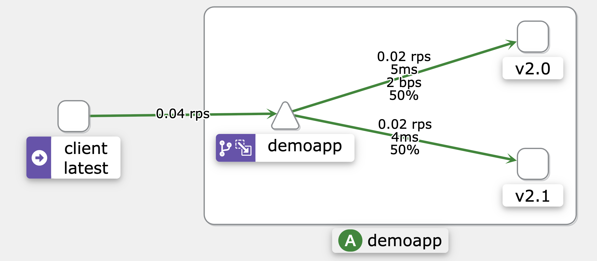

# Istio 流量管理 - 流量镜像示例

本示例演示了 Istio 的流量镜像（Traffic Mirroring）功能，通过将生产流量复制到镜像服务，实现无风险的测试和监控。

官网文档: https://istio.io/latest/zh/docs/tasks/traffic-management/mirroring/

## 应用架构

本示例部署了同一应用的两个不同版本：

- **Demoapp v2.0** (生产版本)
  - 镜像: `vvoo/demoapp:v2.0`
  - 部署: 2 个副本
  - 标签: `version: v2.0`
  - 环境变量:
    - `PORT`: 8080
    - `VERSION`: v2.0

- **Demoapp v2.1** (镜像版本)
  - 镜像: `vvoo/demoapp:v2.1`
  - 部署: 2 个副本
  - 标签: `version: v2.1`
  - 环境变量:
    - `PORT`: 8080
    - `VERSION`: v2.1

## 流量镜像功能说明

流量镜像（也称为影子流量）是一种强大的功能，它允许将实时流量的副本发送到镜像服务，而不会影响实际的生产流量。主要特点：

1. **无风险测试**
   - 镜像流量不会影响生产环境
   - 可以安全地测试新版本的功能和性能

2. **实时监控**
   - 可以观察新版本在真实流量下的表现
   - 收集性能指标和错误率数据

3. **渐进式发布**
   - 在完全切换流量之前验证新版本
   - 降低发布风险

## Istio 流量管理配置

### DestinationRule

定义了两个服务子集:
- `v20`: 对应 `version: v2.0` 标签的 Pod（生产版本）
- `v21`: 对应 `version: v2.1` 标签的 Pod（镜像版本）

```yaml
apiVersion: networking.istio.io/v1beta1
kind: DestinationRule
metadata:
  name: demoapp
spec:
  host: demoapp
  subsets:
  - name: v20
    labels:
      version: v2.0
  - name: v21
    labels:
      version: v2.1
```

### VirtualService

配置流量镜像:

```yaml
apiVersion: networking.istio.io/v1beta1
kind: VirtualService
metadata:
  name: demoapp
spec:
  hosts:
    - demoapp
  http:
  - route:
    - destination: # 主路由目标
        host: demoapp
        subset: v20 # 路由到 v2.0 版本
      weight: 100 # 100% 的流量都路由到主目标
    mirror: # 流量镜像配置
      host: demoapp
      subset: v21 # 镜像到 v2.1 版本
    mirrorPercentage: # 镜像流量百分比
      value: 100 # 100% 的流量都会被镜像
```

## 部署说明

按以下顺序部署应用和 Istio 配置:

```bash
# 部署应用
kubectl apply -f deploy-demoapp.yaml
kubectl apply -f deploy-demoapp-v21.yaml

# 应用 Istio 流量管理配置
kubectl apply -f destinationrule.yaml
kubectl apply -f virtualservice.yaml
```

## 访问测试

使用以下命令测试流量镜像:

```bash
# 创建测试客户端
kubectl run client -it --rm --image=vvoo/admin-box --restart=Never --command -- bash

# 发送请求到服务
while true; do curl demoapp; sleep 0.$RANDOM; done
```

### 测试结果分析

1. **主流量响应**
   - 所有请求都会收到来自 v2.0 版本的响应
   - 响应时间正常，不受镜像影响

2. **镜像流量**
   - 相同的请求会被复制到 v2.1 版本
   - 镜像请求的响应会被丢弃
   - 可以通过日志观察到镜像流量的处理情况

## 流量镜像的应用场景

1. **新版本测试**
   - 在真实流量下测试新版本
   - 验证功能和性能表现

2. **性能对比**
   - 比较新旧版本的性能指标
   - 收集响应时间、资源使用等数据

3. **错误检测**
   - 监控新版本在真实流量下的错误率
   - 及时发现潜在问题

4. **容量规划**
   - 评估新版本所需的资源
   - 为正式发布做准备

## 流量镜像最佳实践

1. **合理设置镜像比例**
   - 根据系统容量设置适当的镜像比例
   - 避免镜像流量影响系统性能

2. **监控镜像服务**
   - 密切监控镜像服务的资源使用
   - 设置适当的告警阈值

3. **日志分析**
   - 收集和分析镜像服务的日志
   - 对比新旧版本的行为差异

4. **渐进式调整**
   - 从小比例开始镜像
   - 根据系统表现逐步调整镜像比例

查看两个版本的日志
```bash
# kubectl logs demoapp-6b9b7b4b4b-lz5s9 
2025/06/02 02:35:16 [INFO] [demoapp-6b9b7b4b4b-lz5s9] GET | 200 | 491.584µs | Client: 127.0.0.6 | Path: / | UA: curl/7.80.0
# kubectl logs demoappv21-64498597c-r2lt9 
2025/06/02 02:35:16 [INFO] [demoappv21-64498597c-r2lt9] GET | 200 | 215.292µs | Client: 10.244.1.48 | Path: / | UA: curl/7.80.0 | X-Forwarded-For: 10.244.1.48

请求响应图

