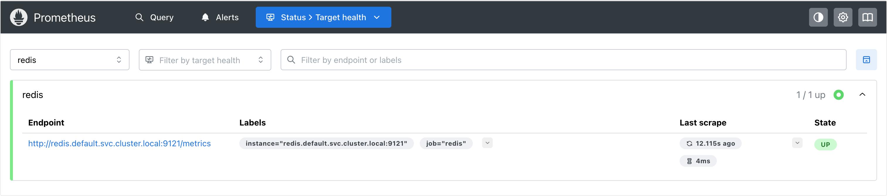
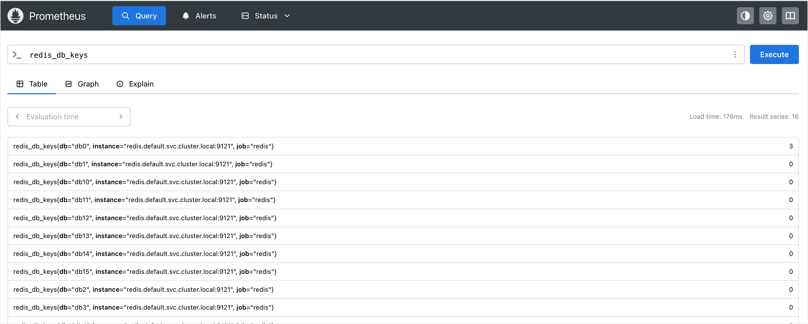

# Kubernetes 应用监控实战指南

Prometheus 的核心优势在于其强大的多维度数据模型和灵活的服务发现机制。对于 Kubernetes 上的应用监控，主要分为两种模式：
1. **内建指标 (Built-in Metrics)**: 应用原生集成了 Prometheus SDK，直接通过 `/metrics` 接口暴露数据。
2. **Exporter 模式**: 对于非云原生应用（如 Redis, MySQL），通过部署伴生容器 (Sidecar) 或独立 Exporter 来转换指标。

## 内建指标监控实战：CoreDNS

CoreDNS 是 Kubernetes 集群的 DNS 解析核心组件，它天然支持 Prometheus 监控。

### 配置分析
默认情况下，Kubernetes 部署的 CoreDNS 已经开启了 metrics 插件。我们可以通过查看 ConfigMap 确认：

```bash
# kubectl get cm -n kube-system coredns -oyaml
apiVersion: v1
data:
  Corefile: |
    .:53 {
        errors
        health {
           lameduck 5s
        }
        ready
        kubernetes cluster.local in-addr.arpa ip6.arpa {
           pods insecure
           fallthrough in-addr.arpa ip6.arpa
           ttl 30
        }
        prometheus :9153  # 开启 Prometheus 监控
        forward . /etc/resolv.conf {
           max_concurrent 1000
        }
        cache 30 {
           disable success cluster.local
           disable denial cluster.local
        }
        loop
        reload
        loadbalance
    }
kind: ConfigMap
metadata:
  creationTimestamp: "2026-01-05T14:40:11Z"
  name: coredns
  namespace: kube-system
  resourceVersion: "227"
  uid: a35609f6-3938-4d4f-aa21-a06cd0f25929
```

**关键配置解析**：
配置中的 `prometheus :9153` 指令表示 CoreDNS 会在 **9153** 端口暴露符合 Prometheus 规范的监控指标。

### 连通性验证
在配置 Prometheus 抓取之前，我们应先验证指标接口是否可访问。

```bash
# kubectl get po -n kube-system -l k8s-app=kube-dns -o wide
NAME                       READY   STATUS    RESTARTS   AGE   IP                NODE     NOMINATED NODE   READINESS GATES
coredns-7d764666f9-nrz2p   1/1     Running   0          14d   192.171.205.129   master   <none>           <none>
coredns-7d764666f9-zq9wj   1/1     Running   0          14d   192.171.205.131   master   <none>           <none>
```

直接请求 Pod IP 的 metrics 接口：

```bash
# curl http://192.171.205.129:9153/metrics
# HELP coredns_build_info A metric with a constant '1' value labeled by version, revision, and goversion from which CoreDNS was built.
# TYPE coredns_build_info gauge
coredns_build_info{goversion="go1.25.2",revision="1db4568",version="1.13.1"} 1
# HELP coredns_cache_entries The number of elements in the cache.
# TYPE coredns_cache_entries gauge
coredns_cache_entries{server="dns://:53",type="denial",view="",zones="."} 1
coredns_cache_entries{server="dns://:53",type="success",view="",zones="."} 0
# HELP coredns_cache_misses_total The count of cache misses. Deprecated, derive misses from cache hits/requests counters.
# TYPE coredns_cache_misses_total counter
coredns_cache_misses_total{server="dns://:53",view="",zones="."} 1
```

从访问的结果可以看出，coredns 已经成功开启了 Prometheus 监控。

### 配置 Prometheus 抓取任务
接下来修改 Prometheus 的 ConfigMap (`prometheus-config`)，新增一个名为 `coredns` 的抓取任务。

```yaml
apiVersion: v1
kind: ConfigMap
metadata:
  name: prometheus-config
  namespace: monitoring
data:
  prometheus.yml: |
    global:
      scrape_interval: 15s
      scrape_timeout: 15s
      
    scrape_configs:
      - job_name: 'prometheus'
        static_configs:
          - targets: ['localhost:9090']
      
      - job_name: 'coredns'
        static_configs:
          - targets: ['192.171.205.129:9153', '192.171.205.131:9153']
```

更新 ConfigMap：

```bash
# kubectl apply -f config-2.yaml 
configmap/prometheus-config configured
```

### 热加载与验证
更新配置后，调用 Prometheus 的 reload 接口触发热加载：

```bash
# kubectl get pods -n monitoring -o wide 
NAME                          READY   STATUS    RESTARTS   AGE   IP              NODE    NOMINATED NODE   READINESS GATES
prometheus-77cd54f4d5-qwjtp   1/1     Running   0          42m   192.165.149.5   node1   <none>           <none>
# curl -X POST "http://192.165.149.5:9090/-/reload"
```

![Placeholder: CoreDNS 监控目标 (Targets) 页面截图] - *请在此补充 Targets 页面显示 CoreDNS 状态的截图*

## Exporter Sidecar 模式实战：Redis

对于像 Redis 这样不直接暴露 HTTP metrics 接口的应用，我们需要使用 **Exporter** (导出器) 模式。在 Kubernetes 中，最佳实践是以 **Sidecar (边车)** 形式，将 Exporter 容器与主应用容器部署在同一个 Pod 中。

### 部署架构设计
我们将创建一个包含两个容器的 Deployment：
1.  **主容器 (`redis`)**: 运行 Redis 数据库服务。
2.  **Sidecar 容器 (`redis-exporter`)**: 运行 `oliver006/redis_exporter`，负责采集本地 Redis 指标并暴露在 9121 端口。

同时创建 Service，暴露 Redis 端口 (6379) 和 Exporter 端口 (9121)。

```yaml
apiVersion: apps/v1
kind: Deployment
metadata:
  name: redis
  namespace: default
spec:
  replicas: 1
  selector:
    matchLabels:
      app: redis
  template:
    metadata:
      labels:
        app: redis
    spec:
      containers:
        - name: redis
          image: redis:7.4
          ports:
            - containerPort: 6379
          resources:
            requests:
              memory: "64Mi"
              cpu: "100m"
            limits:
              memory: "128Mi"
              cpu: "200m"
        - name: redis-exporter
          image: oliver006/redis_exporter:latest
          ports:
            - containerPort: 9121
          resources:
            requests:
              memory: "32Mi"
              cpu: "50m"
            limits:
              memory: "64Mi"
              cpu: "100m"
---
apiVersion: v1
kind: Service
metadata:
  name: redis
  namespace: default
spec:
  selector:
    app: redis
  ports:
    - port: 6379
      name: redis
      targetPort: 6379
    - port: 9121
      name: redis-exporter
      targetPort: 9121
```

### 部署与状态检查
应用配置并查看资源状态，可以看到 Pod 中包含 `2/2` 个容器，说明 Sidecar 模式部署成功。

```bash
# kubectl get pods
NAME                    READY   STATUS    RESTARTS   AGE
redis-fcc47cd88-qltx2   2/2     Running   0          22s

# kubectl get service
NAME         TYPE        CLUSTER-IP      EXTERNAL-IP   PORT(S)             AGE
kubernetes   ClusterIP   172.16.0.1      <none>        443/TCP             15d
redis        ClusterIP   172.16.102.39   <none>        6379/TCP,9121/TCP   2m3s
```

### 指标数据验证
通过 Service IP 访问 Exporter 的 9121 端口，验证指标转换是否成功。可以看到 `redis_up 1` 表示 Redis 存活。

```bash
# curl http://172.16.102.39:9121/metrics
# HELP process_cpu_seconds_total Total user and system CPU time spent in seconds.
# TYPE process_cpu_seconds_total counter
process_cpu_seconds_total 0.01
# HELP process_max_fds Maximum number of open file descriptors.
# TYPE process_max_fds gauge
process_max_fds 524287
......
# HELP redis_allocator_resident_bytes allocator_resident_bytes metric
# TYPE redis_allocator_resident_bytes gauge
redis_allocator_resident_bytes 5.619712e+06
# HELP redis_allocator_rss_bytes allocator_rss_bytes metric
# TYPE redis_allocator_rss_bytes gauge
redis_allocator_rss_bytes 2.842624e+06
# HELP redis_allocator_rss_ratio allocator_rss_ratio metric
# TYPE redis_allocator_rss_ratio gauge
redis_allocator_rss_ratio 2.02
```

### 配置 Prometheus 抓取任务
由于 Redis Exporter 通过 Service `redis` 暴露服务，我们在 Prometheus 配置中可以直接使用 Kubernetes 集群内的 DNS 域名 (`redis.default.svc.cluster.local:9121`) 进行服务发现。

```yaml
- job_name: 'redis'
  static_configs:
    - targets: ['redis.default.svc.cluster.local:9121']
```

更新配置并热加载：

```bash
# kubectl apply -f config-3.yaml 
configmap/prometheus-config configured

# curl -X POST "http://172.16.24.147:9090/-/reload"
```






