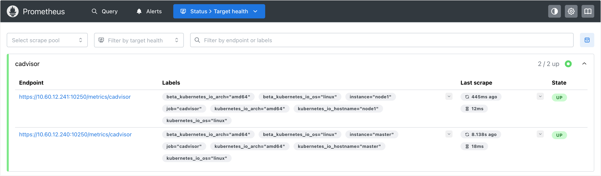
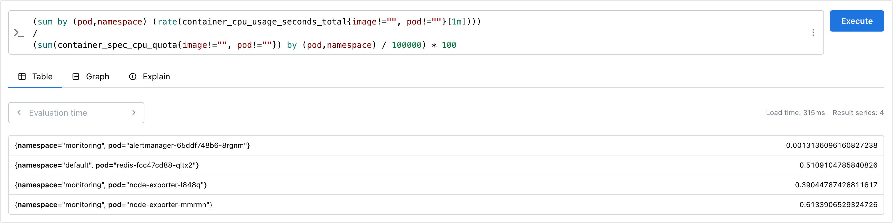
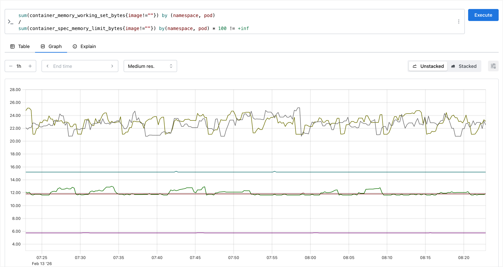

# 容器监控
说到容器监控，则可以想到cadvisor，cadvisor已经内置在kublet中，所以不需要额外部署。cadvisor的数据路径为 `/api/v1/nodes/{node}/proxy/metrics`，但是不推荐使用这种方式，因为这种方式是通过APIServer去代理访问的，对于大规模的集群会对APIServer造成压力。所以我们可以直接通过访问 kubelet 的 `/metrics/cadvisor` 接口来获取 cadvisor 的数据。

## cadvisor
这里使用 node 的服务发现，因为每一个节点下面都有 cadvisor，所以可以使用 node 的服务发现来获取 cadvisor 的数据。添加配置如下

```yaml
- job_name: 'cadvisor'
  kubernetes_sd_configs:
    - role: node
  scheme: https
  tls_config:
    ca_file: /var/run/secrets/kubernetes.io/serviceaccount/ca.crt
    insecure_skip_verify: true
  bearer_token_file: /var/run/secrets/kubernetes.io/serviceaccount/token
  relabel_configs:
    - action: labelmap
      regex: __meta_kubernetes_node_label_(.+)
      replacement: $1
    - replacement: /metrics/cadvisor
      target_label: __metrics_path__
```

这里的配置和前面配置的 node-exporter 的配置类似，只是这里的 metrics_path 是 `/metrics/cadvisor`，而不是 `/metrics`。这样就可以通过访问 kubelet 的 `/metrics/cadvisor` 接口来获取 cadvisor 的数据。注意的是，这里指定了 `__metrics_path__` 的路径为 `/metrics/cadvisor`。 配置完成后，更新配置，查看 Targets 页面，可以看到 cadvisor 的数据。




# 指标查询
我们可以通过切换到 Graph 页面，然后输入查询语句来查询指标。例如，我们可以查询容器的 CPU 使用情况，kubelet 中的 cadvisor 采集的指标和含义，可以参考 [cadvisor 指标](https://github.com/google/cadvisor/blob/master/docs/storage/prometheus.md)。 比如其中的 `container_cpu_usage_seconds_total` 表示容器累计使用 CPU 的秒数，是一个累积值，需要除以时间才能得到 CPU 使用率。

首先计算容器的 CPU 占用时间，由于节点上的 CPU 有多个，所以需要将容器在每个 CPU 上的使用时间加起来。使用 `sum by (pod, namespace)` 来对容器在每个 CPU 上的使用时间进行求和。
比如查询 Pod 在1m内累计使用的 CPU 时间为：
```promql
sum by (pod,namespace) (rate(container_cpu_usage_seconds_total{image!="", pod!=""}[1m]))
```
然后计算 CPU 的总时间，这里的 CPU 数量就是容器分配到的 CPU 数量，`container_spec_cpu_quota` 这个指标就是容器的 CPU 配额，它的值是容器指定的 `CPU 个数 * 100000`，例如容器的 CPU 配额Limit 设置为 100m ，即 0.1 个 CPU，那么 `container_spec_cpu_quota` 的值为 10000（0.1*100000），所以 Pod 在 1s 内的 CPU 的总时间为：Pod 的 CPU 核数 * 1s：
```promql
sum(container_spec_cpu_quota{image!="", pod!=""}) by (pod,namespace) / 10000
```
> 由于 `container_spec_cpu_quota` 是容器的 CPU 配额，所以只有配置了 resources.limits.cpu 的 Pod 才会有这个指标。

将上面这两个语句相除，就可以得到 Pod 的 CPU 使用率：
```promql
(sum by (pod,namespace) (rate(container_cpu_usage_seconds_total{image!="", pod!=""}[1m])))
/
(sum(container_spec_cpu_quota{image!="", pod!=""}) by (pod,namespace) / 100000) * 100
```
在Prometheus 里面执行上面的 promql 语句，可以看到 Pod 的 CPU 使用率。



Pod的内存使用率的计算方式就相对简单一些，不过也需要先了解几个和Pod内存使用率相关的指标：

| 指标名称 (Metric Name)                   | 含义说明 (Description)                                       | 关键注意点 (Key Notes)                                       |
| :--------------------------------------- | :----------------------------------------------------------- | :----------------------------------------------------------- |
| **`container_memory_cache`**             | **页缓存 (Page Cache)**<br>容器内进程读写文件时，操作系统为了加速 I/O 而使用的缓存内存。 | **可回收 (Reclaimable)**。<br>当系统内存紧张时，内核会优先释放这部分内存。不要因为此值高而误以为内存泄漏。 |
| **`container_memory_rss`**               | **常驻内存集 (Resident Set Size)**<br>进程实际占用的物理内存，包括堆 (Heap)、栈 (Stack) 和匿名内存。 | **不可回收 (Non-reclaimable)**。<br>这是应用真正运行所需的“硬”内存。如果 RSS 持续上涨且接近 Limit，通常意味着内存泄漏。 |
| **`container_memory_swap`**              | **交换空间 (Swap) 使用量**<br>容器使用的磁盘交换分区大小。   | Kubernetes 默认通常禁用 Swap。如果此值不为 0，说明宿主机开启了 Swap 且容器被允许使用，这会严重影响性能。 |
| **`container_memory_failcnt`**           | **内存分配失败次数**<br>对应 Cgroup v1 的 `memory.failcnt` 文件。 | 这是一个计数器。数值增加意味着容器尝试申请内存时被内核拒绝（通常是触碰到了 Limit）。 |
| **`container_memory_failures_total`**    | **内存分配失败累积总数**<br>同上，通常是 Prometheus 采集转换后的累积计数指标。 | 如果此曲线增长，说明容器正在经历或已经经历了 OOM (Out Of Memory) 风险。 |
| **`container_memory_usage_bytes`**       | **当前内存总使用量**<br>计算公式大致为：`RSS + Cache + Swap` (部分版本含 Kernel Memory)。 | **误导性最强**。<br>因为它包含了 Cache，所以即使应用本身空闲，此值也可能很高。**不建议直接用于 OOM 告警**。 |
| **`container_memory_working_set_bytes`** | **工作集内存 (Working Set)**<br>计算公式：`Usage - Inactive File` (总用量减去不活跃的文件缓存)。 | **核心告警指标**。<br>这是 Kubernetes 判断是否触发 OOM Kill 的依据。它代表了容器为了正常运行“必须”持有的内存。 |
| **`container_memory_max_usage_bytes`**   | **历史最大内存使用量**<br>记录容器生命周期内达到的内存使用峰值。 | **容量规划依据**。<br>用于辅助设置 Resource Limit。如果你看到 Max 值远低于 Limit，说明资源申请过多，可以缩容。 |

整体来说，`container_memory_max_usage_bytes > container_memory_usage_bytes >= container_memory_working_set_bytes > container_memory_rss` ，从上面的指标描述来看似乎 `container_memory_usage_bytes` 指标可以更容易用来跟踪内存使用率，但是该指标还包括在内存压力下可能被驱逐的缓存（比如文件系统缓存），更好的指标是使用 `container_memory_working_set_bytes`，因为 kubelet 也是根据该指标来判断是否触发 OOM Kill。所以用 working set 指标来评估内存使用率会更准确。对应的 promql 语句为：
```promql
sum(container_memory_working_set_bytes{image!=""}) by (namespace, pod) 
/
sum(container_spec_memory_limit_bytes{image!=""}) by(namespace, pod) * 100 != +inf
```
在 Prometheus 中执行上面的 promql 语句，可以看到 Pod 的内存使用率。



