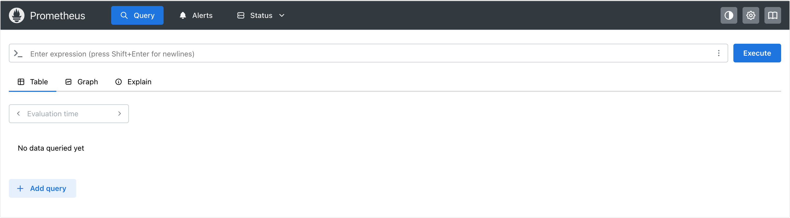
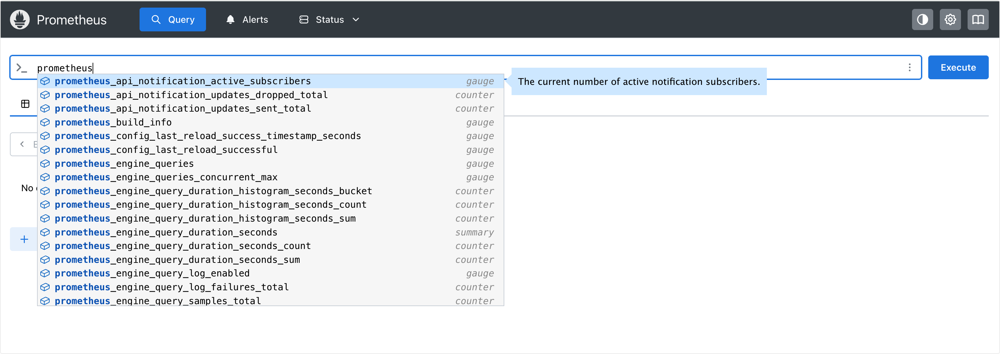

# Prometheus Kubernetes 部署实战指南

本文档详细记录了在 Kubernetes 集群中手动部署 Prometheus 的全过程。我们将从零开始构建监控基础设施，并深入分析在部署过程中遇到的典型权限问题及其底层原理。

## 基础环境准备 (Environment Preparation)

### 创建命名空间
为了实现资源隔离，防止监控组件干扰业务应用，我们首先创建一个独立的命名空间 `monitoring`。

```bash
kubectl create ns monitoring
```

### 配置文件管理 (ConfigMap)
Prometheus 的核心配置 `prometheus.yml` 我们采用 ConfigMap 进行管理。这种方式允许我们在不重新构建镜像的情况下，通过修改 ConfigMap 并触发热加载（Hot Reload）来更新监控规则。

```bash
kubectl apply -f config-1.yaml
```

## 存储架构设计 (Storage Configuration)

为了保证 Prometheus 监控数据的持久性与读写性能，生产环境建议使用本地存储（Local Permissions）。相比于 NFS 等网络存储，本地 SSD 能提供更低的 I/O 延迟，避免因网络波动导致数据写入失败。

### 创建宿主机数据目录
我们在目标节点（本例为 `node1`）上手动创建持久化目录。
> **注意**：由于 LocalPV 强绑定节点，需确保后续 Pod 调度到该节点。


```bash
# mkdir -p /data/k8s/prometheus

# ls /data/k8s/prometheus -d
/data/k8s/prometheus
```

### 部署存储资源
创建 PersistentVolume (PV) 和 PersistentVolumeClaim (PVC) 资源对象，建立 Kubernetes 存储抽象层。

```bash
kubectl apply -f storage.yaml
```

## 权限访问控制 (RBAC)

Prometheus 依赖 Kubernetes API Server 进行服务发现 (Service Discovery)，自动抓取集群中的 Pod、Service、Node 等指标。因此，必须授予其相应的读取权限。

我们创建 ServiceAccount、ClusterRole 和 ClusterRoleBinding，赋予 Prometheus 对 `nodes`, `services`, `endpoints`, `pods` 等核心资源的 `get`, `list`, `watch` 权限。

```bash
kubectl apply -f rbac.yaml
```

## 部署与深度故障排查 (Deployment & Troubleshooting)

### 第一阶段：初次部署与状态观察
应用 Deployment 配置文件，启动 Prometheus 实例。

```bash
# kubectl apply -f deploy.yaml 
deployment.apps/prometheus created

# kubectl get pods -n monitoring
NAME                         READY   STATUS             RESTARTS     AGE
prometheus-58fc4f796-jsx7f   0/1     CrashLoopBackOff   1 (3s ago)   4s
```

**现象分析**：
Pod 状态显示为 `CrashLoopBackOff`，表明容器启动失败并反复重启。READY 状态为 `0/1`，说明主容器未能正常运行。

### 第二阶段：日志分析与根因定位 (Root Cause Analysis)
查看 Pod 日志以定位具体的错误信息：

```bash
# kubectl logs -f prometheus-58fc4f796-jsx7f -n monitoring 
time=2026-01-20T13:52:21.785Z level=INFO source=main.go:1589 msg="updated GOGC" old=100 new=75
time=2026-01-20T13:52:21.785Z level=INFO source=main.go:704 msg="Leaving GOMAXPROCS=2: CPU quota undefined" component=automaxprocs
time=2026-01-20T13:52:21.785Z level=INFO source=memlimit.go:198 msg="GOMEMLIMIT is updated" component=automemlimit package=github.com/KimMachineGun/automemlimit/memlimit GOMEMLIMIT=3386787840 previous=9223372036854775807
time=2026-01-20T13:52:21.785Z level=INFO source=main.go:803 msg="Starting Prometheus Server" mode=server version="(version=3.9.1, branch=HEAD, revision=9ec59baffb547e24f1468a53eb82901e58feabd8)"
time=2026-01-20T13:52:21.785Z level=INFO source=main.go:808 msg="operational information" build_context="(go=go1.25.5, platform=linux/amd64, user=root@61c3a9212c9e, date=20260107-16:08:09, tags=netgo,builtinassets)" host_details="(Linux 6.12.0-55.41.1.el10_0.x86_64 #1 SMP PREEMPT_DYNAMIC Fri Oct 31 14:20:11 UTC 2025 x86_64 prometheus-58fc4f796-jsx7f (none))" fd_limits="(soft=524287, hard=524288)" vm_limits="(soft=unlimited, hard=unlimited)"
time=2026-01-20T13:52:21.785Z level=ERROR source=query_logger.go:113 msg="Error opening query log file" component=activeQueryTracker file=/prometheus/queries.active err="open /prometheus/queries.active: permission denied"
panic: Unable to create mmap-ed active query log

goroutine 1 [running]:
github.com/prometheus/prometheus/promql.NewActiveQueryTracker({0x7ffc2944adfd, 0xb}, 0x14, 0xc00035ba80)
        /app/promql/query_logger.go:145 +0x345
main.main()
        /app/cmd/prometheus/main.go:894 +0x8953
```

**深度解析**：
核心错误信息为 `open /prometheus/queries.active: permission denied`。
这是一个典型的 Kubernetes 存储挂载权限问题。
1.  **文件系统层面**：我们在宿主机创建的 `/data/k8s/prometheus` 目录，其所有者（Owner）默认是 `root` 用户。
2.  **容器运行层面**：Prometheus 官方镜像为了安全起见，默认使用非特权用户 `nobody` (UID 65534) 运行进程。
3.  **冲突点**：当宿主机的目录挂载到容器内 ` /prometheus` 路径时，容器内的 `nobody` 用户试图写入属于 `root` 的目录，导致权限被拒绝。

通过检查目录权限可以验证这一点：
```bash
# ls -la /data/k8s/
total 0
drwxr-xr-x 3 root root 24 Jan 20 21:50 .
drwxr-xr-x 3 root root 17 Jan 20 21:50 ..
drwxr-xr-x 2 root root  6 Jan 20 21:50 prometheus
```

### 第三阶段：修复与最终验证
为了解决权限冲突，我们利用 Kubernetes 的 **InitContainer** 机制。InitContainer 在主容器启动之前运行，并且通常具有更高的权限（如 root）。我们可以在这里修改挂载卷的所有权。

在 `deploy-fixed.yaml` 中，我们添加了如下配置：
```yaml
......
initContainers:
- name: init-volume
    image: busybox:1.36
    command: ["sh", "-c", "chown -R nobody:nobody /prometheus"]
    volumeMounts:
    - name: data
        mountPath: /prometheus
```
这段配置会启动一个临时的 busybox 容器，将 `/prometheus` 挂载点（即宿主机的 `/data/k8s/prometheus`）的所有权递归修改为 `nobody`，从而允许主容器正常写入。

应用修复后的配置并验证：

```bash
# kubectl apply -f deploy-fixed.yaml 
deployment.apps/prometheus configured

# kubectl get pods -n monitoring 
NAME                          READY   STATUS    RESTARTS   AGE
prometheus-77cd54f4d5-qwjtp   1/1     Running   0          17s
```

查看日志确认 TSDB 数据库已成功初始化：

```bash
# kubectl logs -f prometheus-77cd54f4d5-qwjtp -n monitoring
Defaulted container "prometheus" out of: prometheus, init-volume (init)
time=2026-01-20T14:00:39.249Z level=INFO source=main.go:1589 msg="updated GOGC" old=100 new=75
time=2026-01-20T14:00:39.249Z level=INFO source=main.go:704 msg="Leaving GOMAXPROCS=2: CPU quota undefined" component=automaxprocs
time=2026-01-20T14:00:39.249Z level=INFO source=memlimit.go:198 msg="GOMEMLIMIT is updated" component=automemlimit package=github.com/KimMachineGun/automemlimit/memlimit GOMEMLIMIT=3386787840 previous=9223372036854775807
time=2026-01-20T14:00:39.249Z level=INFO source=main.go:803 msg="Starting Prometheus Server" mode=server version="(version=3.9.1, branch=HEAD, revision=9ec59baffb547e24f1468a53eb82901e58feabd8)"
time=2026-01-20T14:00:39.249Z level=INFO source=main.go:808 msg="operational information" build_context="(go=go1.25.5, platform=linux/amd64, user=root@61c3a9212c9e, date=20260107-16:08:09, tags=netgo,builtinassets)" host_details="(Linux 6.12.0-55.41.1.el10_0.x86_64 #1 SMP PREEMPT_DYNAMIC Fri Oct 31 14:20:11 UTC 2025 x86_64 prometheus-77cd54f4d5-qwjtp (none))" fd_limits="(soft=524287, hard=524288)" vm_limits="(soft=unlimited, hard=unlimited)"
time=2026-01-20T14:00:39.251Z level=INFO source=web.go:684 msg="Start listening for connections" component=web address=0.0.0.0:9090
time=2026-01-20T14:00:39.251Z level=INFO source=main.go:1331 msg="Starting TSDB ..."
......
time=2026-01-20T14:00:39.257Z level=INFO source=main.go:1355 msg="TSDB started"
time=2026-01-20T14:00:39.257Z level=INFO source=main.go:1542 msg="Loading configuration file" filename=/etc/prometheus/prometheus.yml
time=2026-01-20T14:00:39.257Z level=INFO source=main.go:1582 msg="Completed loading of configuration file" db_storage=988ns remote_storage=1.255µs web_handler=236ns query_engine=711ns scrape=115.102µs scrape_sd=16.569µs notify=1.06µs notify_sd=678ns rules=1.348µs tracing=4.161µs filename=/etc/prometheus/prometheus.yml totalDuration=297.814µs
time=2026-01-20T14:00:39.257Z level=INFO source=main.go:1316 msg="Server is ready to receive web requests."
```

## 服务对外暴露 (Service Exposure)

为了让外部用户能够访问 Prometheus 的 Web 界面，我们创建 Service 对象。本例使用 NodePort 类型，将服务映射到节点的随机端口上。

```bash
kubectl apply -f svc.yaml
```

部署完成后，可以通过浏览器访问 `http://<NodeIP>:<NodePort>` 查看监控 Dashboard。







