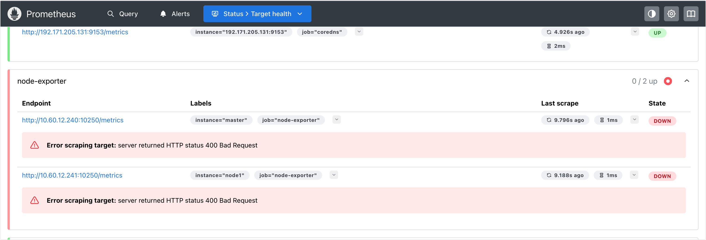
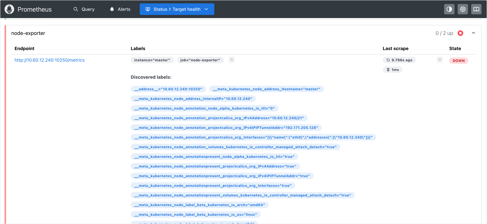
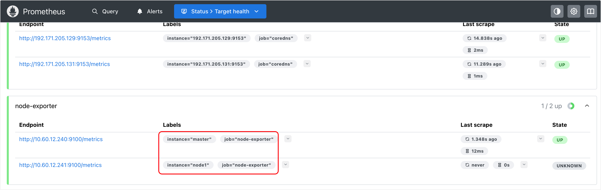
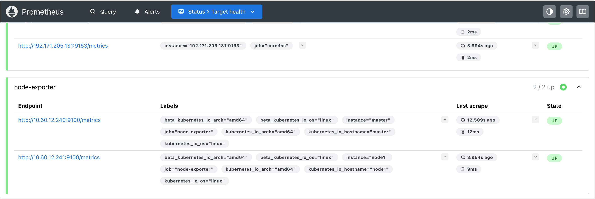
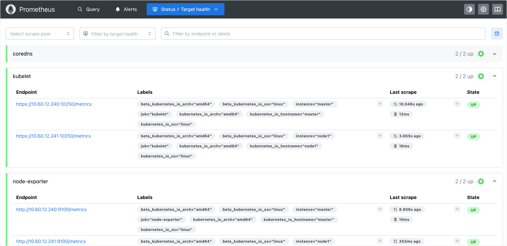
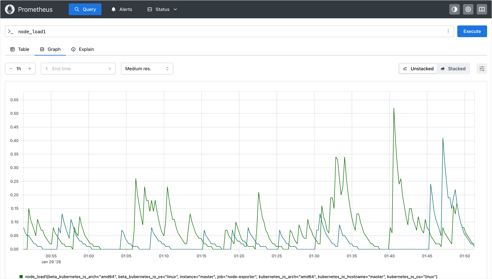

# Kubernetes 节点监控实战指南

Kubernetes 集群的节点监控主要分为两个层面：
1. **主机层 (Host Level)**: 监控 CPU、内存、磁盘 IO、网络等硬件资源指标。这通常通过 **Node Exporter** 实现。
2. **Kubernetes 核心组件层**: 监控 Kubelet、Kube-Proxy 等组件的运行状态。Kubelet 内置了 cAdvisor，也暴露了容器运行时的资源使用情况。

## 部署 Node Exporter

Node Exporter 是 Prometheus 官方提供的用于采集 *NIX 系统内核指标的 Exporter。

### 架构设计 (DaemonSet)
由于我们需要监控集群中的**每一个**节点，因此采用 **DaemonSet** 控制器来部署 Node Exporter。这能确保新加入集群的节点会自动运行一个 Exporter 实例。

### 配置深度解析
在部署配置中，有几个关键的 `spec` 字段需要特别注意，它们决定了 Exporter 能否准确采集到宿主机数据：

*   **`hostNetwork: true`**: 让 Pod 直接使用宿主机的网络命名空间。
*   **`hostPID: true`**: 允许访问宿主机的进程命名空间。
*   **`volumeMounts` (hostPath)**: 将宿主机的 `/proc` (进程信息) 和 `/sys` (系统信息) 目录挂载到容器中，这是采集内核指标的来源。

```yaml
apiVersion: apps/v1
kind: DaemonSet
metadata:
  name: node-exporter
  namespace: monitoring
  labels:
    app: node-exporter
spec:
  selector:
    matchLabels:
      app: node-exporter
  template:
    metadata:
      labels:
        app: node-exporter
    spec:
      hostPID: true
      hostIPC: true
      hostNetwork: true
      nodeSelector:
        kubernetes.io/os: linux
      containers:
        - name: node-exporter
          image: prom/node-exporter:latest
          args:
            - --web.listen-address=$(HOST_IP):9100
            - --path.procfs=/host/proc
            - --path.sysfs=/host/sys
            - --path.rootfs=/host/root
            - --no-collector.hwmon
            - --no-collector.nvme
            - --no-collector.rapl
            - --no-collector.timex
            - --no-collector.wifi
            - --no-collector.nfs
            - --no-collector.dmi
            - --collector.filesystem.mount-points-exclude=^/(dev|proc|sys|var/lib/docker/.+|var/lib/kubelet/.+)($|/)
            - --collector.filesystem.fs-types-exclude=^(overlay|tmpfs|devtmpfs|squashfs|autofs|binfmt_misc|cgroup|configfs|debugfs|devpts|fuse.gvfsd-fuse|hugetlbfs|mqueue|proc|sysfs|tracefs)$
          ports:
            - containerPort: 9100
          env:
            - name: HOST_IP
              valueFrom:
                fieldRef:
                  fieldPath: status.hostIP
          resources:
            requests:
              memory: "32Mi"
              cpu: "50m"
            limits:
              memory: "64Mi"
              cpu: "100m"
          securityContext:
            runAsNonRoot: true
            runAsUser: 65532
            runAsGroup: 65532
          volumeMounts:
            - name: proc
              mountPath: /host/proc
              readOnly: true
            - name: sys
              mountPath: /host/sys
              readOnly: true
            - name: root
              mountPath: /host/root
              mountPropagation: HostToContainer
              readOnly: true
      tolerations: # 添加污点容忍
        - operator: Exists
      volumes:
        - name: proc
          hostPath:
            path: /proc
        - name: sys
          hostPath:
            path: /sys
        - name: root
          hostPath:
            path: /
```

### 部署验证

```bash
# kubectl apply -f node-exporter.yaml 
daemonset.apps/node-exporter created

# kubectl get po -n monitoring -l app=node-exporter -o wide 
NAME                  READY   STATUS    RESTARTS   AGE   IP             NODE     NOMINATED NODE   READINESS GATES
node-exporter-l848q   1/1     Running   0          12s   10.60.12.241   node1    <none>           <none>
node-exporter-mmrmn   1/1     Running   0          12s   10.60.12.240   master   <none>           <none>
```

验证指标数据：

```bash
# curl http://10.60.12.241:9100/metrics
......
node_cpu_seconds_total{cpu="0",mode="idle"} 1.83957526e+06
node_cpu_seconds_total{cpu="0",mode="iowait"} 63.5
node_cpu_seconds_total{cpu="0",mode="irq"} 2639.46
node_cpu_seconds_total{cpu="0",mode="nice"} 24.66
node_cpu_seconds_total{cpu="0",mode="softirq"} 564.2
node_cpu_seconds_total{cpu="0",mode="steal"} 0
......
```

## Prometheus 服务发现机制

在 Kubernetes 中，Prometheus 主要支持 5 种服务发现模式：Node、Service、Pod、Endpoints、Ingress。对于节点监控，最适用的自然是 **Node** 模式。

### 节点自动发现

当前集群节点状态：
```bash
# kubectl get node 
NAME     STATUS   ROLES           AGE   VERSION
master   Ready    control-plane   22d   v1.35.0
node1    Ready    <none>          22d   v1.35.0
```

修改 Prometheus 配置，配置 `kubernetes_sd_configs` 的 `role` 为 `node`，这会让 Prometheus 自动连接 APIServer 并查询所有 Node 对象。

```yaml
- job_name: 'node-exporter'
  kubernetes_sd_configs:
    - role: node
```

应用配置并热加载：

```bash
# kubectl apply -f config-4.yaml 
configmap/prometheus-config configured

# curl -X POST "http://192.165.149.5:9090/-/reload"
```

查看 Targets 页面：


### 端口冲突问题 (The Port 10250 Problem)

我们发现虽然发现了 2 个节点，但状态为 Down，报错：
```bash
Error scraping target: server returned HTTP status 400 Bad Request
```

**根因分析**：
Prometheus 使用 `role: node` 发现服务时，默认会使用 Node 对象中定义的地址和端口。Kubernetes Node 默认监听在 **10250** 端口（Kubelet HTTPS 端口），该端口需要 TLS 认证。
而我们部署的 Node Exporter 监听在 **9100** 端口（HTTP）。

Prometheus 尝试访问 `https://<NodeIP>:10250/metrics`，但这并不是 Node Exporter 的地址，因此导致失败。

## Relabeling 配置 (高级)

为了解决上述端口不匹配问题，我们需要使用 Prometheus 强大的 **Relabel (重标签)** 机制。

Relabeling 允许我们在采集（Scrape）发生之前，修改抓取目标的元数据。我们需要做的是：找到目标的地址标签，并将端口从 10250 替换为 9100。

查看 Service Discovery 页面，我们可以找到 `__address__` 标签，它包含了默认的地址信息：


### 端口替换
我们添加如下 `relabel_configs`：

```yaml
- job_name: 'node-exporter'
  kubernetes_sd_configs:
    - role: node
  relabel_configs:
    - source_labels: [__address__]
      regex: ([^:]+):10250
      target_label: __address__
      replacement: $1:9100
      action: replace
```
**配置解析**：
1.  **source_labels**: 读取原始的 `__address__` (例如 `192.168.1.5:10250`)。
2.  **regex**: 使用正则 `([^:]+):10250` 提取 IP 地址部分 (Group 1)。
3.  **replacement**: 构造新地址 `$1:9100` (即 `192.168.1.5:9100`)。
4.  **target_label**: 将新地址写回 `__address__`，Prometheus 将使用这个新地址进行抓取。

重新加载后，抓取成功：


### 标签映射 (LabelMap)

现在虽然能抓取到数据，但指标上的标签太少，只有一个 `instance` (IP地址)。Kubernetes Node 对象上有很多有用的标签（如 `kubernetes.io/hostname`, `topology.kubernetes.io/zone` 等），我们希望将这些标签保留到监控指标中，以便后续聚合查询。

我们继续添加 Relabel 规则：

```yaml
    - action: labelmap
      regex: __meta_kubernetes_node_label_(.+)
      replacement: $1
```
Kubernetes 服务发现会将 Node 的元数据保存在 `__meta_kubernetes_node_label_<LabelName>` 形式的内部标签中。`labelmap` 会匹配正则，并将匹配部分（也就是 LabelName）提升为指标的真实标签。

最终配置效果：


## Kubelet 监控

Kubelet 自身（端口 10250）也暴露了关键的监控指标，包括 cAdvisor收集的容器资源使用情况。由于 Kubelet 强制开启 HTTPS 且需要认证，我们需要配置 Prometheus 的 TLS 参数。

### 安全认证配置
1.  **Scheme**: 设为 `https`。
2.  **TLS Config**: 使用 ServiceAccount 的 CA 证书进行验证（或跳过验证）。
3.  **Bearer Token**: 为 Prometheus 注入 ServiceAccount 的 Token，用于通过 Kubelet 的鉴权。

```yaml
- job_name: 'kubelet'
  kubernetes_sd_configs:
    - role: node
  scheme: https
  tls_config:
    ca_file: /var/run/secrets/kubernetes.io/serviceaccount/ca.crt
    insecure_skip_verify: true
  bearer_token_file: /var/run/secrets/kubernetes.io/serviceaccount/token
  relabel_configs:
    - action: labelmap
      regex: __meta_kubernetes_node_label_(.+)
      replacement: $1
```

更新配置并 Reload 后：


可以看到 `kubelet` 和 `node-exporter` 两个 Job 都运行正常，且都通过 LabelMap 继承了节点的标签。

### 数据查询
切换到 Graph 页面，输入 `node_load1`，即可查看所有节点的负载情况。


